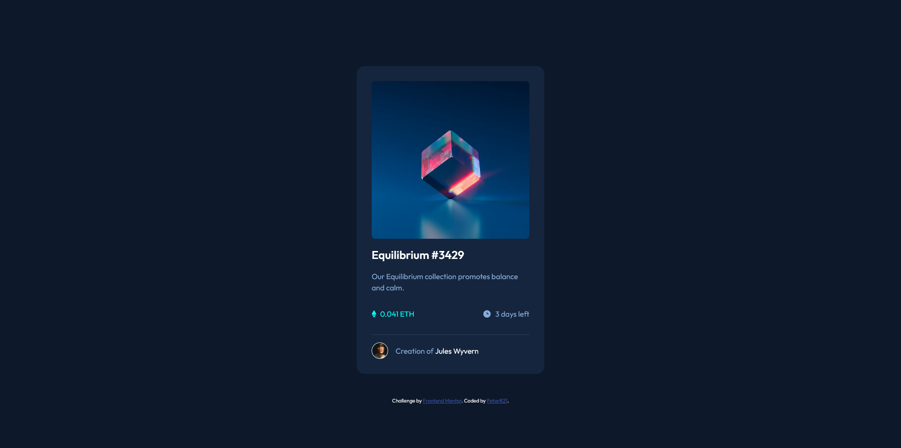
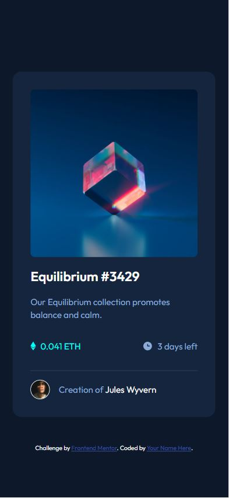

# Frontend Mentor - Product preview card component solution

This is a solution to the [NFT preview card component](https://www.frontendmentor.io/challenges/nft-preview-card-component-SbdUL_w0U/hub). Frontend Mentor challenges help you improve your coding skills by building realistic projects.

## Table of contents

- [Overview](#overview)
  - [Screenshot](#screenshot)
  - [Links](#links)
- [My process](#my-process)
  - [Built with](#built-with)
- [Author](#author)

## Overview

### The challenge

Users should be able to:

- View the optimal layout depending on their device's screen size
- See hover and focus states for interactive elements

### Screenshot

#### Desktop

#### Mobile

### Links

- Solution URL: [https://github.com/PetarR21/product-preview-card-component](https://github.com/PetarR21/nft-preview-card-component)
- Live Site URL: [https://petarr21.github.io/product-preview-card-component](https://petarr21.github.io/nft-preview-card-component)

## My process

### Built with

- Semantic HTML5 markup
- CSS custom properties
- Flexbox
- CSS Grid
- Mobile-first workflow

## Author

- Website - [PetarR21](https://github.com/PetarR21)
- Frontend Mentor - [@PetarR21](https://www.frontendmentor.io/profile/PetarR21)
